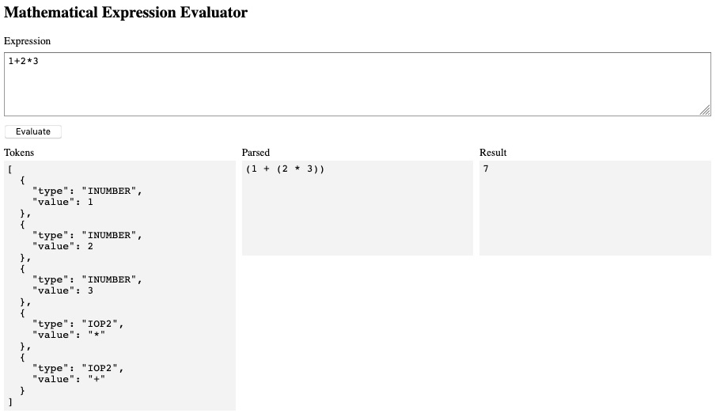

# Sandbox for Mathematical Expression Evaluator

This is a simple web page to explore the [Mathematical Expression Evaluator](https://github.com/silentmatt/expr-eval). See it in action [here](https://eliot-akira.github.io/expr-eval-sandbox).



## Use

```sh
yarn # or "npm install"
yarn serve # "npm run serve"
```

Go to [http://localhost:3000](http://localhost:3000).

### Library Path

Optionally, you can pass the file path to the `expr-eval` script to use in the sandbox.

```sh
yarn serve ../expr-eval/dist/bundle.js # or "npm run serve --"
```

This can be useful during development of the library.
